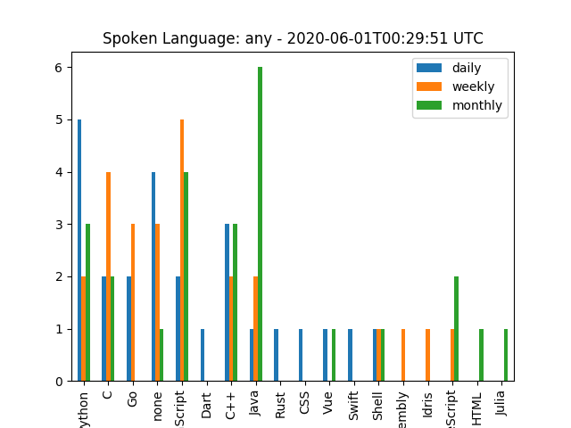
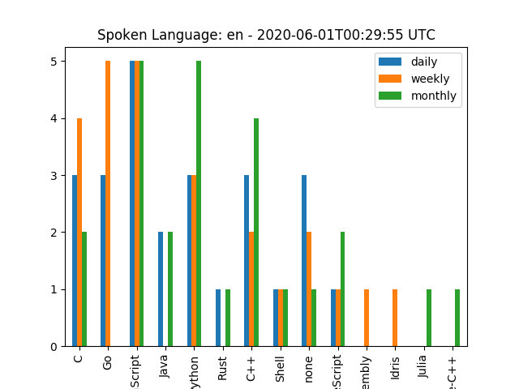
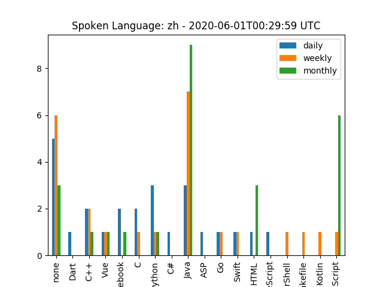

# Github Program Trending

Statistics by programming language according to Github Trending list

Automatic update via Github Action

## Trending by spoken language







## Usage

```python
python github-program-trending.py
```
